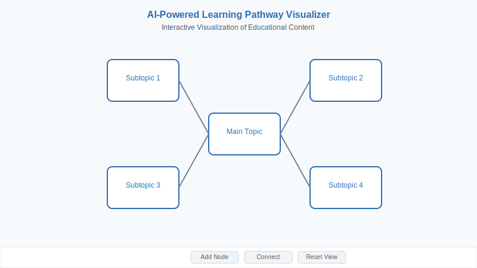

# AI-Powered Learning Pathway Visualizer

An interactive visualization platform that transforms educational content into dynamic, personalized mind maps using AI. The application leverages OpenRouter API (specifically google/gemini-2.5-pro-exp-03-25) to generate educational content presented in a hierarchical tree visualization.



## Table of Contents

- [Overview](#overview)
- [Features](#features)
- [Architecture](#architecture)
- [Project Structure](#project-structure)
- [File Connections](#file-connections)
- [Data Flow](#data-flow)
- [API Integration](#api-integration)
- [Key Components](#key-components)
- [Installation](#installation)
- [Configuration](#configuration)
- [Contributing](#contributing)

## Overview

This application allows educators and learners to create interactive learning pathways based on topics and complexity levels. The system uses AI to generate structured content including topics, questions, resources, equations, and code examples. The content is visualized as an interactive mind map where nodes can be explored, connected, and enhanced.

## Features

- **AI-powered content generation**: Create learning pathways with AI-generated educational content
- **Interactive visualization**: Explore and navigate learning pathways through a dynamic mind map
- **Double-click navigation**: Focus on specific nodes and their connections with double-click
- **Node customization**: Edit and enhance nodes with additional content (questions, resources, equations, code examples)
- **Connection management**: Create and manage relationships between learning topics
- **Responsive design**: Clean, intuitive interface inspired by Miro and LucidChart
- **Mathematical equation display**: Render mathematical equations using KaTeX
- **Code example formatting**: Present code snippets with proper formatting and syntax highlighting

### Recent Enhancements

- **Reset View Functionality**: Added a Reset View button that clears all highlighting and returns the view to its normal state
- **Double-Click Behavior**: Implemented a double-click interaction that highlights connected nodes and edges while dimming others
- **Visual Feedback**: Enhanced visual feedback with animated edges and color highlighting for connected elements
- **User Instructions**: Added helpful tooltips to inform users about interactive features like double-clicking
- **Improved Navigation**: Better focus management when exploring complex learning pathways

## Architecture

The application follows a modern full-stack JavaScript architecture:

### Frontend
- React with TypeScript
- ReactFlow for visualization
- React Query for API data fetching and caching
- Shadcn UI components with Tailwind CSS for styling
- Context API for state management

### Backend
- Express.js server
- In-memory storage (MemStorage)
- RESTful API endpoints
- OpenRouter API integration for AI content generation

## Project Structure

```
├── client/              # Frontend React application
│   ├── src/
│   │   ├── components/  # UI components
│   │   ├── hooks/       # Custom React hooks
│   │   ├── lib/         # Utility functions, API client
│   │   ├── pages/       # Route components
│   │   ├── types/       # TypeScript type definitions
│   │   ├── App.tsx      # Main application component
│   │   └── main.tsx     # Entry point
│   └── index.html       # HTML template
├── server/              # Backend Express server
│   ├── index.ts         # Server entry point
│   ├── routes.ts        # API route definitions
│   ├── storage.ts       # Data storage implementation
│   └── vite.ts          # Vite integration with server
├── shared/              # Shared code between frontend and backend
│   └── schema.ts        # Database schema and types
└── various config files # Configuration for TypeScript, Vite, etc.
```

## File Connections

### Client-Side Flow

1. `client/src/main.tsx` - Main entry point that renders the application
2. `client/src/App.tsx` - Main application component that sets up routing
3. `client/src/pages/Dashboard.tsx` - Main dashboard page that displays learning pathways
4. `client/src/components/FlowCanvas.tsx` - Core visualization component using ReactFlow
5. `client/src/components/Node.tsx` - Custom node component for ReactFlow
6. `client/src/components/NodeDetail.tsx` - Detailed view and editing for nodes
7. `client/src/components/Sidebar.tsx` - Side navigation and pathway management
8. `client/src/components/TopBar.tsx` - Top navigation bar with actions
9. `client/src/lib/api.ts` - API client functions for backend communication
10. `client/src/lib/hooks.ts` - Custom hooks for data fetching and UI state
11. `client/src/lib/queryClient.ts` - React Query setup and configuration
12. `client/src/types/index.ts` - TypeScript type definitions for the application

### Server-Side Flow

1. `server/index.ts` - Main entry point for the Express server
2. `server/routes.ts` - API route definitions and handlers
3. `server/storage.ts` - Data storage implementation (in-memory)
4. `server/vite.ts` - Vite integration for development server
5. `server/logger.ts` - Logging utility
6. `shared/schema.ts` - Database schema and type definitions shared between frontend and backend

## Data Flow

### 1. User Interface to Backend
- User interacts with the UI (creates a new pathway, adds/edits nodes, etc.)
- React components update state and trigger API calls
- API requests are processed through React Query and the API client

### 2. Backend Processing
- Express server receives requests through defined routes
- Routes validate input using zod schemas and call appropriate storage methods
- For AI-generated content, the server communicates with OpenRouter API

### 3. Data Storage and Retrieval
- Data is stored in memory using the MemStorage implementation
- CRUD operations are handled through the storage interface
- Data is returned to the frontend for display

### 4. ReactFlow Visualization
- Nodes and edges are converted to ReactFlow format
- Layout algorithms position nodes in a hierarchical structure
- User interactions (click, double-click, drag) update the visualization

## API Integration

### OpenRouter API
- Used to generate learning pathways and enhance nodes
- Communicates with google/gemini-2.5-pro-exp-03-25 model
- Requires an API key stored as an environment variable
- Error handling for rate limiting and malformed responses

### Internal API Endpoints

#### Pathways
- `GET /api/pathways` - Get all pathways
- `GET /api/pathways/:id` - Get specific pathway
- `POST /api/pathways` - Create new pathway
- `PATCH /api/pathways/:id` - Update pathway
- `DELETE /api/pathways/:id` - Delete pathway

#### Nodes
- `GET /api/pathways/:id/nodes` - Get all nodes for a pathway
- `GET /api/nodes/:id` - Get specific node
- `POST /api/nodes` - Create new node
- `PATCH /api/nodes/:id` - Update node
- `DELETE /api/nodes/:id` - Delete node

#### Edges
- `GET /api/pathways/:id/edges` - Get all edges for a pathway
- `GET /api/edges/:id` - Get specific edge
- `POST /api/edges` - Create new edge
- `PATCH /api/edges/:id` - Update edge
- `DELETE /api/edges/:id` - Delete edge

#### AI Generation
- `POST /api/generate` - Generate new learning pathway
- `POST /api/nodes/:id/enhance` - Enhance node with AI-generated content

## Key Components

### FlowCanvas
The core visualization component that renders the interactive mind map. Features include:
- Double-click to focus on connected nodes
- Node selection and editing
- Connection management
- Automatic layout

### Node
Custom node component for ReactFlow that displays:
- Node title and description
- Topics list
- Expandable sections for questions, resources, equations, and code examples
- Mathematical equation rendering with KaTeX

### NodeDetail
Modal component for editing node details:
- Fields for title and description
- Sections for enhancing with AI-generated content (questions, resources, equations, code examples)

### Sidebar
Navigation and management component:
- List of available pathways
- Form for creating new pathways
- Selection of active pathway

### API Client
Handles communication with the backend:
- Data fetching for pathways, nodes, and edges
- Mutation functions for creating and updating data
- Helper functions for data transformation and layout

## Installation

1. Clone the repository
```bash
git clone https://github.com/yourusername/learning-pathway-visualizer.git
cd learning-pathway-visualizer
```

2. Install dependencies
```bash
npm install
```

3. Set up environment variables
```
# Create a .env file with the following:
OPENROUTER_API_KEY=your_api_key_here
```

4. Start the development server
```bash
npm run dev
```

## Configuration

### Environment Variables
- `OPENROUTER_API_KEY` - API key for OpenRouter

### Theme Configuration
- Edit `theme.json` to customize the application appearance:
  - `primary`: Main color (default: #2B6CB0)
  - `variant`: Theme variant (professional, tint, vibrant)
  - `appearance`: Color mode (light, dark, system)
  - `radius`: Border radius for UI elements

### ReactFlow Customization
- Node types and styles are defined in `client/src/components/Node.tsx`
- Edge types and styles are defined in `client/src/components/FlowCanvas.tsx`
- Layout algorithms are defined in `client/src/lib/api.ts`

## Contributing

Contributions are welcome! Please feel free to submit a Pull Request.

1. Fork the repository
2. Create your feature branch (`git checkout -b feature/amazing-feature`)
3. Commit your changes (`git commit -m 'Add some amazing feature'`)
4. Push to the branch (`git push origin feature/amazing-feature`)
5. Open a Pull Request